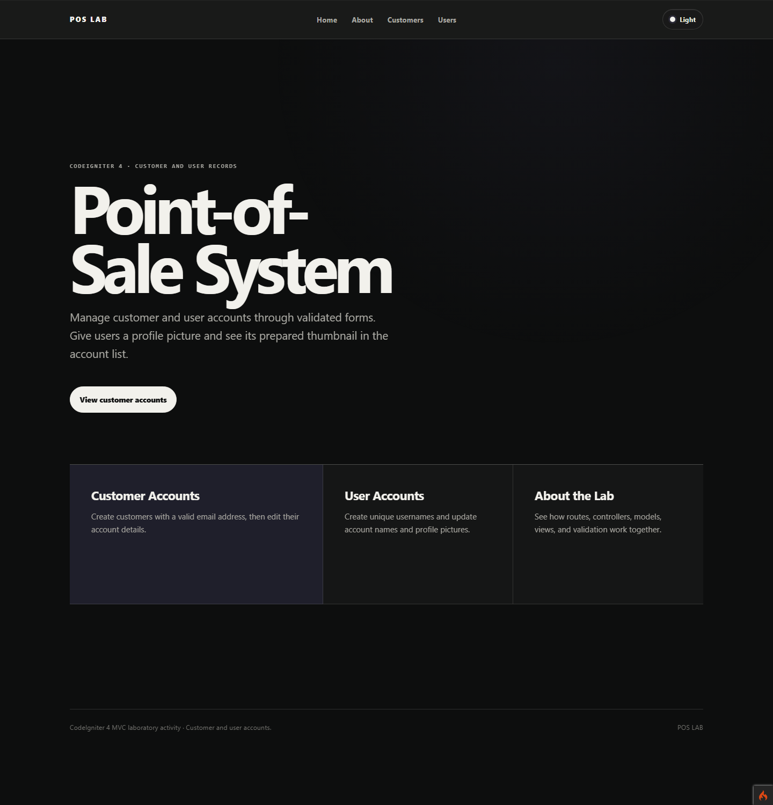
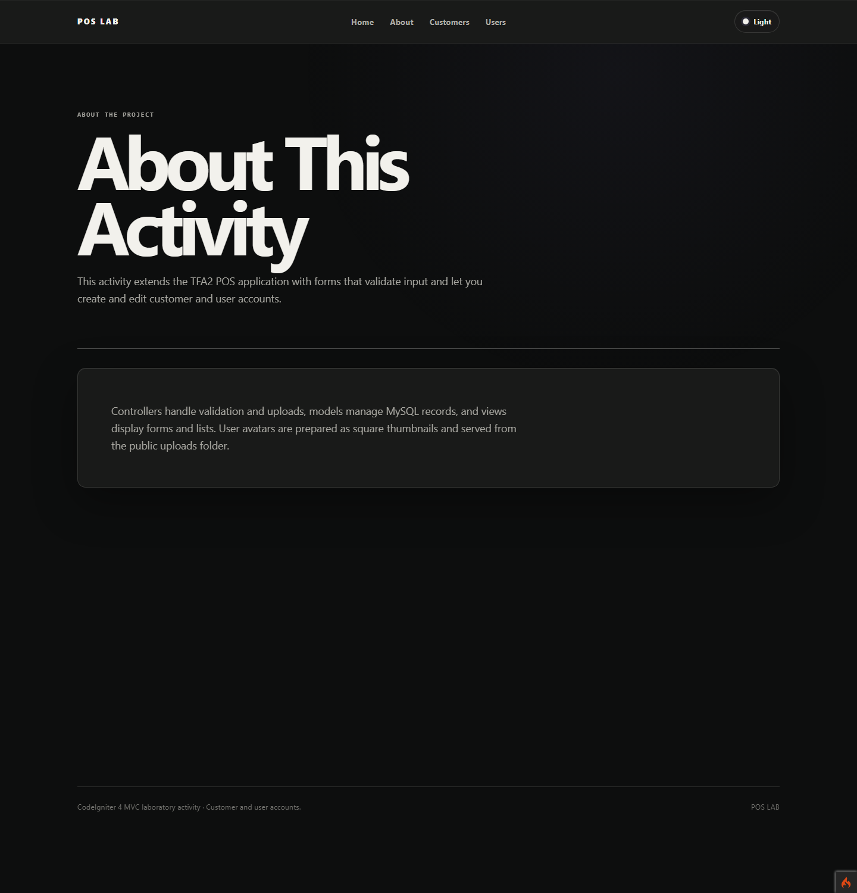
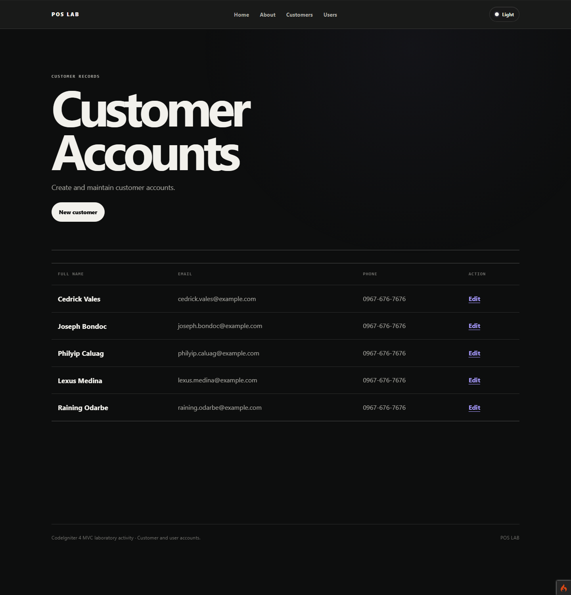
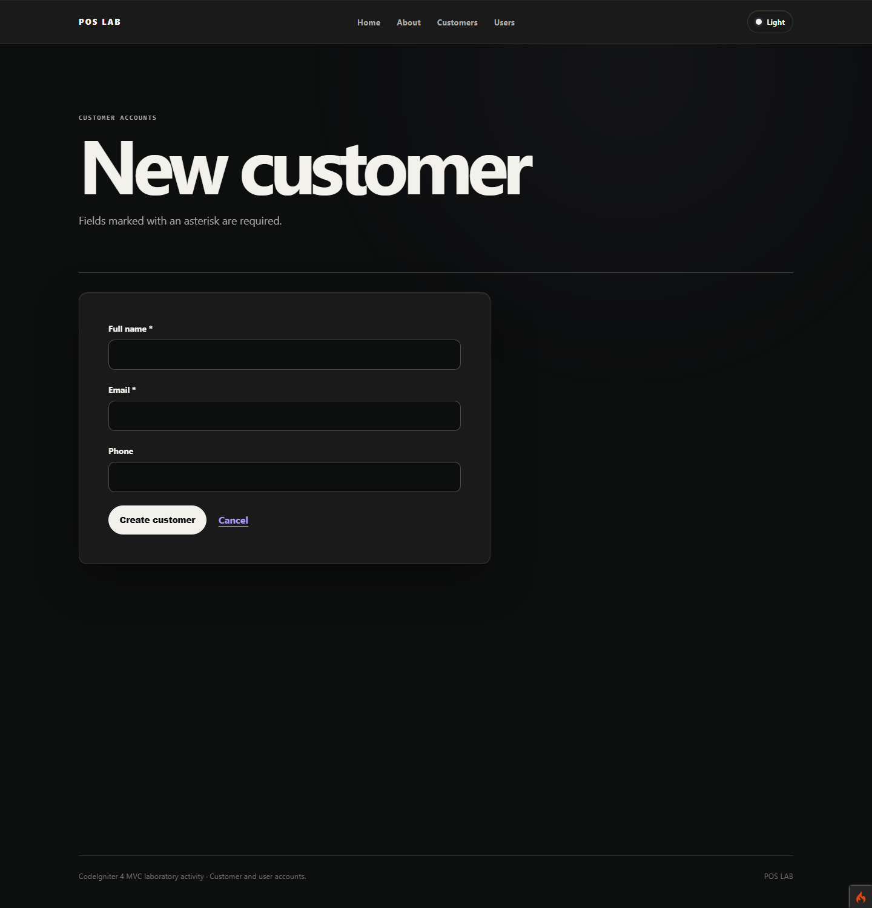
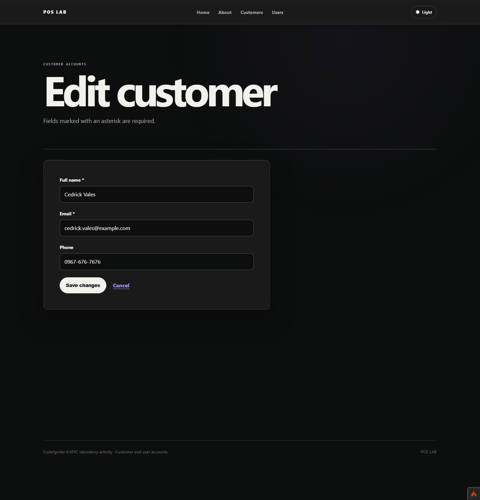
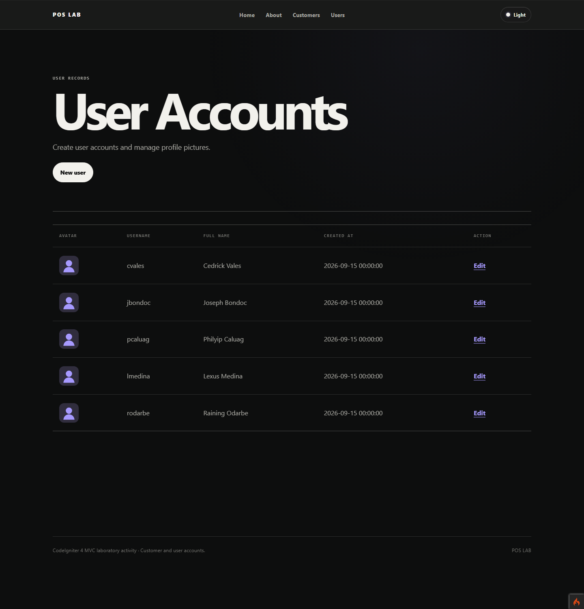
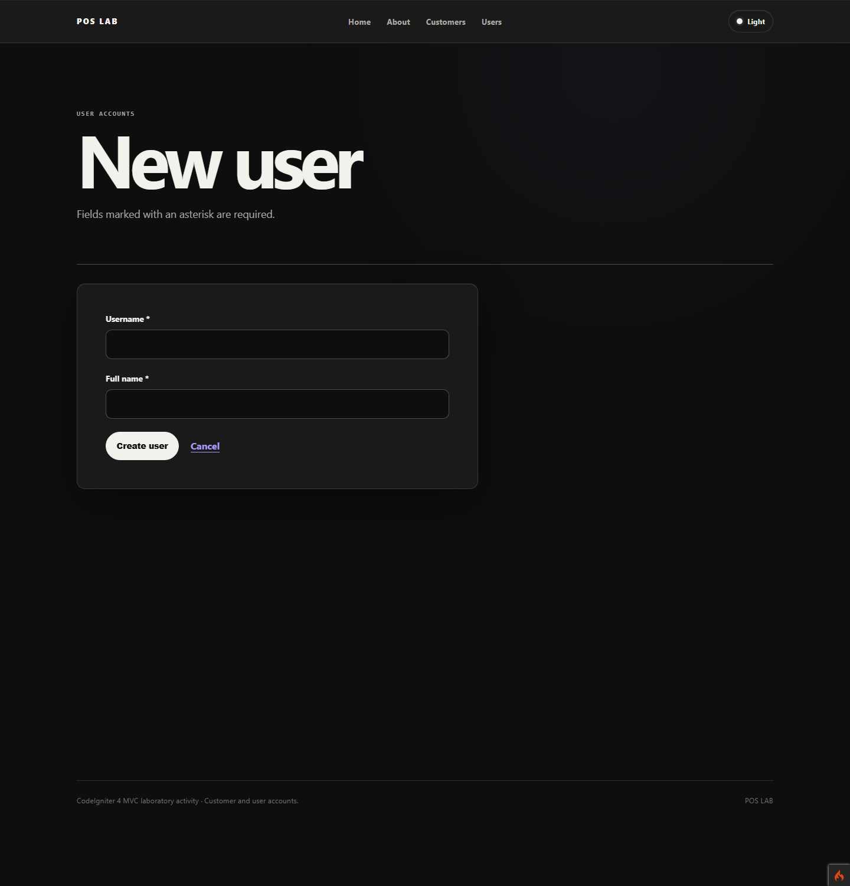
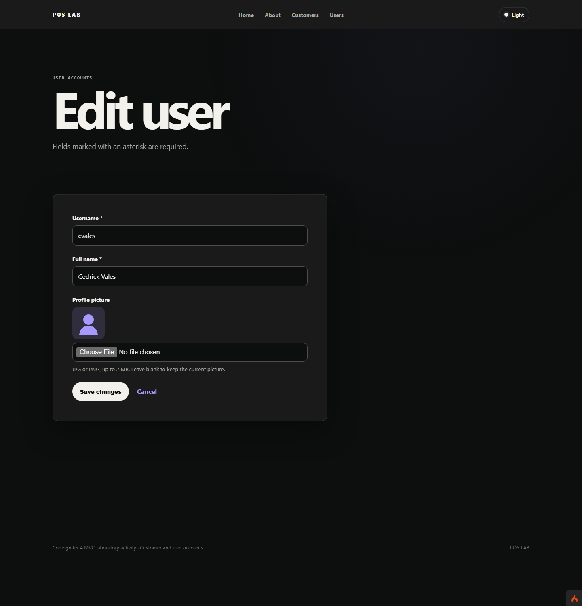

# TFA4 — POS staff authentication

This CodeIgniter 4 project continues [TFA3](https://github.com/bonkval/TFA3). It protects customer and user account management behind staff login, verifies password hashes, and provides logout. Customer/user CRUD and avatar uploads from TFA3 are retained.

## Screenshots

### Home (`/`)

### About (`/about`)

### Customer Accounts (`/customers`)

### New Customer (`/customers/new`)

### Edit Customer (`/customers/1/edit`)

### User Accounts (`/users`)

### New User (`/users/new`)

### Edit User (`/users/1/edit`)

## Local setup

1. Run `composer install`.
2. Create a database named `tfa3_pos` using UTF-8 (`utf8mb4`).
3. Copy `.env.example` to `.env` and adjust the base URL and database settings.
4. Initialize the database using **one** of these approaches:
   - Import `database/tfa3_pos.sql` into `tfa3_pos` to get the five customers and five users from TFA2.
   - Or run `php spark migrate` followed by `php spark db:seed DatabaseSeeder` for fresh sample records.
5. Run `php spark serve` and open `http://localhost:8080/`.
6. Sign in with any seeded username (for example, `cvales`) and the starter password `password`.

If you already have a TFA3 database and want to keep its current records, point TFA4 at a **copy** of that database and run `php spark migrate`. The new migration adds a password column and assigns each existing account a hash of the starter password `password`.

The SQL import includes password hashes for the starter password `password`. Do not combine the SQL import with `migrate` on the same database: the SQL file already creates both tables and their columns.

## Pages

| Page | Purpose |
| --- | --- |
| `/customers` | List customers and open edit forms |
| `/customers/new` | Create a customer with required name and valid email |
| `/customers/{id}/edit` | Update an existing customer |
| `/users` | List users with prepared avatars or a placeholder |
| `/users/new` | Create a user with a unique username and required full name |
| `/users/{id}/edit` | Update a user and optionally upload an avatar |
| `/login` | Sign in as a staff member |
| `/logout` | Destroy the current session |

Both forms redisplay submitted values and field errors when validation fails. Avatar uploads accept only JPG or PNG files up to 2 MB. CodeIgniter's image service creates a 256 × 256 image in `public/uploads/avatars/`, and the database stores only its generated filename. The upload directory is ignored by Git, so uploaded images must be copied separately when moving an existing deployment.

## Deployment

Point the web server document root at `public/`, set a production `.env` using `.env.production.example`, enable the PHP GD extension, and allow the web server to write to `writable/` and `public/uploads/avatars/`. Import the SQL file or run the migrations and seeder as described above. Change the sample user passwords after initial setup. Set `app.baseURL` to the actual hosted URL.

### Render from GitHub

The included `Dockerfile` runs PHP 8.3 with Apache and the extensions this app needs. Render can build it directly from this GitHub repository. GitHub Pages cannot run this PHP application.

1. Arrange a **persistent MySQL database** first. Use an external MySQL provider that accepts connections from Render, or [deploy MySQL as a Render private service](https://render.com/docs/deploy-mysql). Render's MySQL option needs a paid persistent disk. Keep the hostname, database name, username, and password handy.
2. In [Render](https://dashboard.render.com/), choose **New → Web Service → Git Provider**, connect GitHub, and select `bonkval/TFA4` on the `main` branch. Choose **Docker** as the language and leave the Dockerfile path as `./Dockerfile`.
3. Choose a **paid web service with a persistent disk** if avatars must survive restarts. Mount the disk at `/var/www/html/public/uploads/avatars`. A free web service can demonstrate the pages, but uploaded avatars disappear after a restart or idle spin-down.
4. Add these environment variables in Render's **Environment** section. Replace the sample values with your service URL and database details; include the trailing slash in the URL:

   | Key | Value |
   | --- | --- |
   | `app_baseURL` | `https://YOUR-SERVICE.onrender.com/` |
   | `database_default_hostname` | MySQL host |
   | `database_default_database` | MySQL database name |
   | `database_default_username` | MySQL username |
   | `database_default_password` | MySQL password |
   | `database_default_DBDriver` | `MySQLi` |
   | `database_default_port` | `3306` |

   `CI_ENVIRONMENT=production` is already set in the Docker image. Keep credentials in Render's environment settings, never in Git.
5. Click **Create Web Service**. On a paid service, open its **Shell** after the first deploy and run `php spark migrate` and `php spark db:seed DatabaseSeeder` to create the tables and sample records. If your database provider has an import tool, you can instead import `database/tfa3_pos.sql` before deploying. Use **one** database initialization approach.
6. Open the `onrender.com` URL and test `/customers`, `/users`, a new record, and a JPG/PNG avatar upload.

Render's free web services have no persistent disks or shell access. Their free Postgres database also expires after 30 days, so it is not a lasting replacement for this project's MySQL database. See [Render's free service limits](https://render.com/docs/free).

Repository: [github.com/bonkval/TFA4](https://github.com/bonkval/TFA4)
